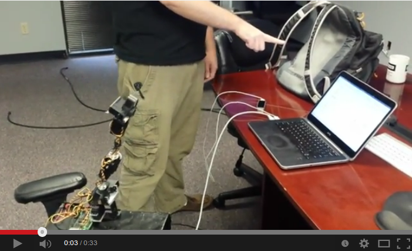

# RoboFinger
> Built with the [Phoenix Framework](https://github.com/phoenixframework/phoenix)

To start your new Phoenix application you have to:

1. Install dependencies with `mix deps.get`
2. Start Phoenix router with `mix phoenix.start`

Now you can visit `localhost:4000` from your browser.

## The Deal

So hook up a leapmotion and an SSC-32-controlled robotic arm.  Now you can
control the robot arm via the web browser.  Enjoy!

